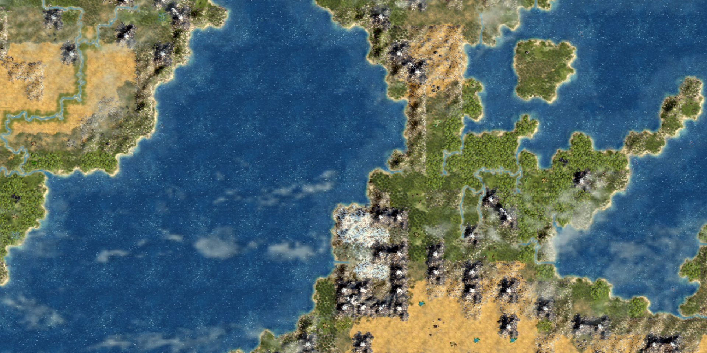

# Superplume: a Perfect World 2 fork

This is yet another trivial fork of the map script Perfect World 2 for Civilization 4.

## Changes

- Place glaciers along the northern and southern edges, as in the official maps.
- Prevent peaks from being next to oceans.
- Ensure that every sea resource is accessible from the coast.
- Simplify the code by removing unnecessary definitions and lines.
- Formatted the code by using Black to make it easier to maintain.

## License

[GNU General Public License v2.0 or later](LICENSE)

## Development Notes

The game's map scripting reference is located at: `Assets\Python\EntryPoints\CvMapScriptInterface.py`.
